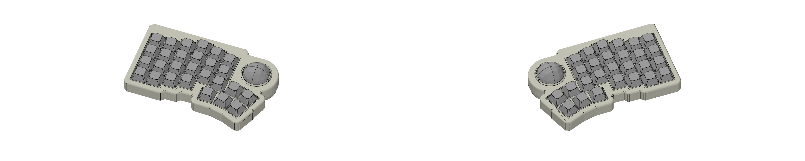

# split-ergo-tb

Generated by [Auto-Keyboard-Design-Kit](https://auto-kdk.pages.dev/)

## Preview

- 3D View

- Top View

## Parts List

|Part|Quantity|
|---|---|
|wireless controller|2|
|Conthrough(2.5mm, 9pin)|4|
|Battery|2|
USB-C cable|1|
|MX switch and MX socket|54|
|Diode|54|
|Keycap|54|

